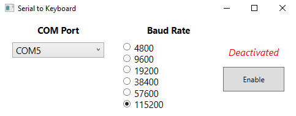

# About

> Posts characters from Serialport to the OS as Keystrokes

This project is a fork of the [SerialPort to Keyboard](https://sourceforge.net/projects/serialporttokey/) project on SourceForge originally posted by ***trommelbohne***.
This fork aims to update the C# library to keep it compatible with newer Windows versions.

    

# License

This project was originally released under the ***Creative Commons Attribution Non-Commercial License v2.0***.
This project will continue to use that same license.